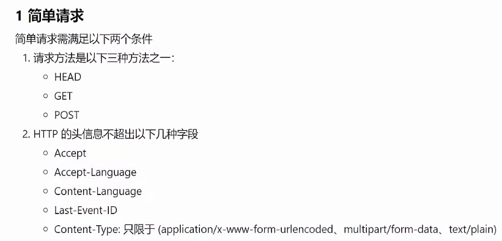
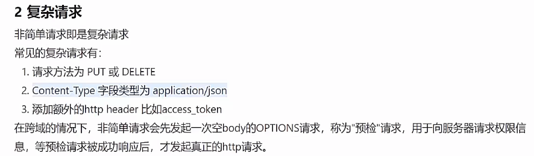
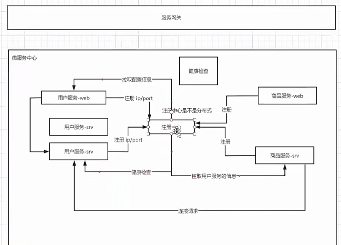
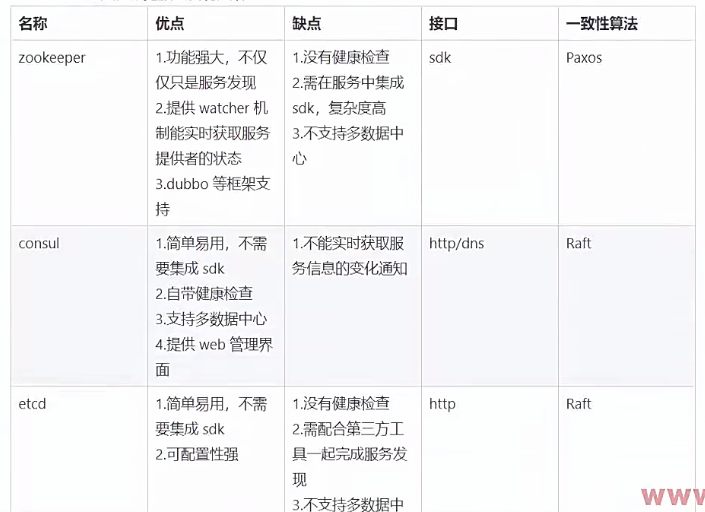
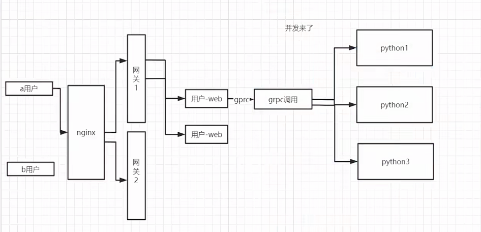
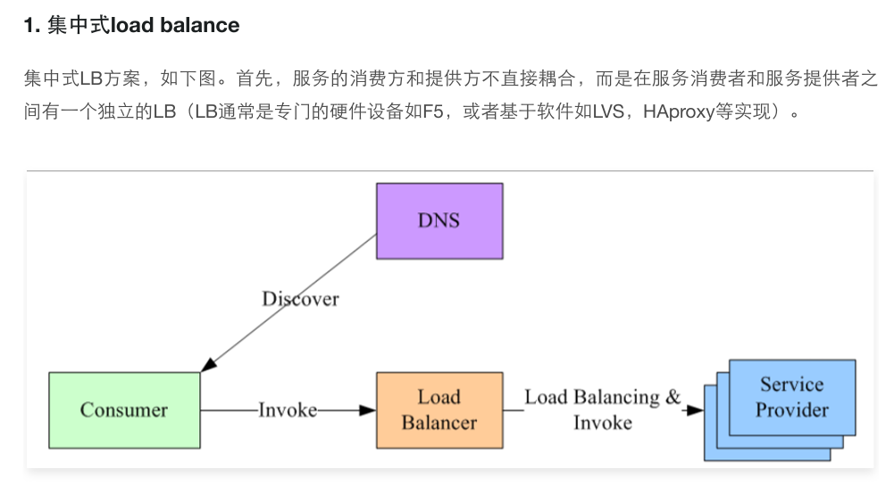
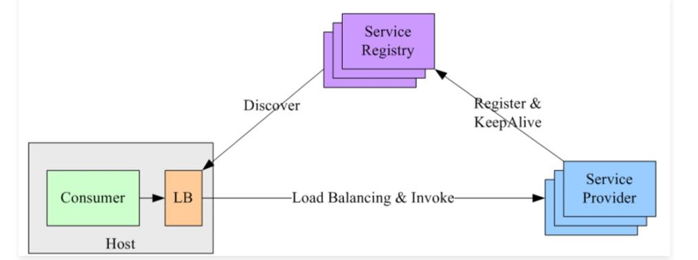
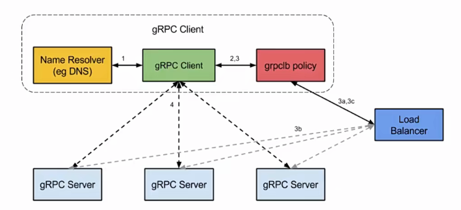
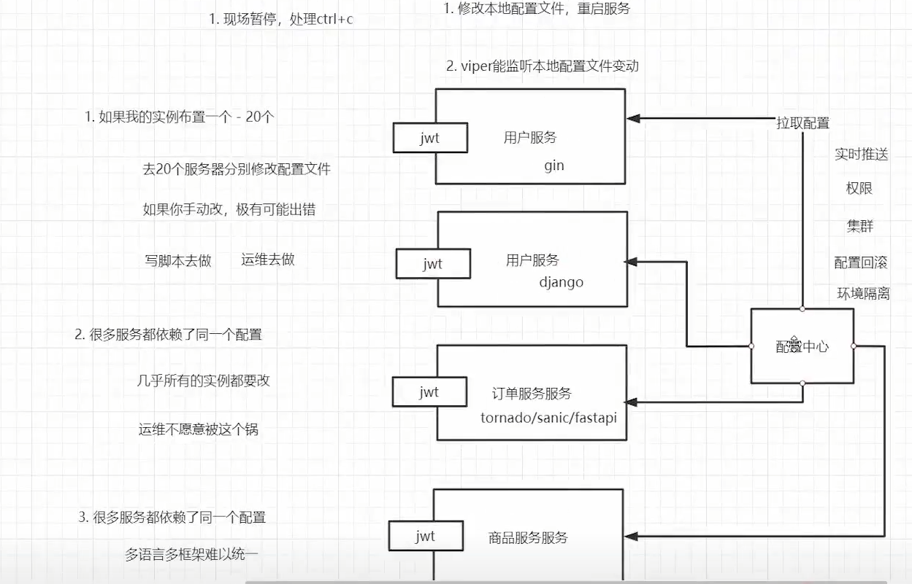
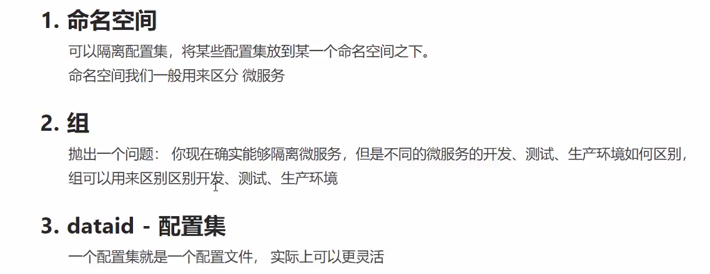

# 微服务设计
## week8 用户grpc服务
1. 同步用户表
```go
type BaseModel struct {
	ID        int32     `gorm:"primary_key"`
	CreatedAt time.Time `gorm:"column:add_time"`
	UpdatedAt time.Time `gorm:"column:update_time"`
	DeletedAt gorm.DeletedAt
	IsDelete  bool
}

type User struct {
	BaseModel
	Mobile   string     `gorm:"index:idx_mobile;unique;type:varchar(11);not null comment '11位电话号码'"`
	Password string     `gorm:"type:varchar(100);not null comment '密码，100位以内'"`
	NickName string     `gorm:"type:varchar(20) comment '昵称，20位以内'"`
	Birthday *time.Time `gorm:"type:datetime comment '出生日期'"`
	Gender   string     `gorm:"column:gender;default:male;type:varchar(6) comment 'female表示女，male表示男'"`
	Role     int        `gorm:"column:role;default:1;type:int comment '1表示普通用户，2表示管理员'"`
}
```
2. md5加密（信息摘要算法，密码不可反解）
    - 压缩性：任意长度的数据，计算出来的md5值都是一样长
    - 容易计算
    - 抗修改性：对于任意长度的数据，对数据进行任何修改，哪怕 modifications 是 ONE BIT， MD5 值也会改变
    - 抗碰撞性：对于任意长度的数据， MD5 函数的计算结果很难出现两个数据结果相同
    - 不可反解
   
     但是md5会被暴力破解（彩虹表）
    - md5盐值加密： 随机字符串+用户密码生成新的密码值 GitHub go-password-encoder
    - password存储： ”$算法$salt$encodedpwd"


3. 定义proto接口
```protobuf
syntax="proto3";
import "google/protobuf/empty.proto";
option go_package = "./;proto";

service User{
  rpc GetUserList(PageInfo) returns (UserListResponse); //用户列表
  rpc GetUserByMobile(MobileRequest) returns (UserInfoResponse);
  rpc GetUserById(IdRequest) returns (UserInfoResponse);
  rpc CreateUser(CreateUserInfo) returns (UserInfoResponse);
  rpc UpdateUser(UpdateUserInfo) returns (google.protobuf.Empty);
  rpc CheckPassword(PasswordCheckInfo) returns (CheckResponse);
}

message PageInfo{
  uint32 pn = 1;
  uint32 pSize = 2;
}

message MobileRequest{
  string mobile = 1;
}

message IdRequest{
  int32 id = 1;
}

message CreateUserInfo{
  string nickName = 1;
  string password = 2;
  string mobile = 3;
}

message UpdateUserInfo{
  int32 id = 1;
  string nickName = 2;
  string gender = 3;
  uint64 birthday = 4;
}

message PasswordCheckInfo{
  string password = 1;
  string encryptedPassword = 2;
}

message UserInfoResponse{
  int32 id = 1;
  string password = 2;
  string mobile = 3;
  string nickName = 4;
  uint64 birthday = 5;
  string gender = 6;
  int32 role = 7;
}

message UserListResponse{
  int32 total = 1;
  repeated UserInfoResponse data = 2;
}

message CheckResponse{
  bool success = 1;
}
```
生成protobuf go文件
```bash
protoc --go_out=. --go-grpc_out=.  user.proto
```
time.Unix(int64(req.Birthday), 0) 整型转时间戳

4. 启动grpc服务
使用flag进行参数解析
```go
    IP := flag.String("ip", "0.0.0.0", "ip地址")
	Port := flag.Int("port", 50052, "端口号")
	flag.Parse()
```
可以先build 在main.exe后面跟上参数，就可以手动指定ip：port

5. 测试grpc服务
建立grpc客户端 --> 编写测试函数 --> 运行测试函数


## week9 用户web服务
### 第一章 基础项目架构
#### zap 高性能日志库
```text
1.zap有两种日志记录器-Sugared Logger 和 Logger
    Sugared Logger: 方便，比其他日志库快4-10倍 需要用到反射，所以比Logger慢一点
    Logger: 更快，但是使用不这么方便，极致的性能
```

```text
2.zap输出到日志文件
# 自定义日志配置
func NewLogger() (*zap.Logger, error) {
	cfg := zap.NewProductionConfig()
	cfg.OutputPaths = []string{
		"stdout",
		"./myproject.log",
	}
	return cfg.Build()
}

logger, err := NewLogger()
	if err != nil {
		return
	}
	sugar := logger.Sugar()
	defer sugar.Sync()

3.直接拿带锁的全局日志
    zap.S() 返回的其实就是Sugared Logger
        1.S()可以获取一个全局的sugar，可以自己设置一个全局的logger
        2.日志是分级别的，debug，info，warn，error，panic，fatal
        3.S函数和L函数很有用，可以提供一个全局的安全访问logger的途径

```

```text
3.将grpc的错误码转换成http的错误码，返回给用户
func HandleGrpcErrorToHttp(err error, ctx *gin.Context) {
	// 将grpc的状态码转换成http的状态码
	if err != nil {
		if e, ok := status.FromError(err); ok {
			switch e.Code() {
			case codes.NotFound:
				ctx.JSON(http.StatusNotFound, gin.H{
					"msg": e.Message(),
				})
			case codes.Internal:
				ctx.JSON(http.StatusInternalServerError, gin.H{
					"msg": "内部错误",
				})
			case codes.InvalidArgument:
				ctx.JSON(http.StatusBadRequest, gin.H{
					"msg": "参数错误",
				})
			case codes.Unavailable:
				ctx.JSON(http.StatusInternalServerError, gin.H{
					"msg": "服务不可用",
				})
			default:
				ctx.JSON(http.StatusInternalServerError, gin.H{
					"msg": "其他错误",
				})
			}
			return
		}
	}

}
```

```text
4.gin集成viper
建立配置文件yaml --> 创建配置文件结构体 --> 创建全局变量保存配置 --> 创建配置文件初始化并读取函数 --> 在main中使用配置变量
```

### 第二章 用户接口开发
#### 表单验证初始化
```text
1.初始化验证器的翻译功能
func InitTrans(locale string) (err error) {
	//修改gin框架中的validator引擎属性, 实现定制
	if v, ok := binding.Validator.Engine().(*validator.Validate); ok {
		//注册一个获取json的tag的自定义方法
		v.RegisterTagNameFunc(func(fld reflect.StructField) string {
			name := strings.SplitN(fld.Tag.Get("json"), ",", 2)[0]
			if name == "-" {
				return ""
			}
			return name
		})

		zhT := zh.New() //中文翻译器
		enT := en.New() //英文翻译器
		//第一个参数是备用的语言环境，后面的参数是应该支持的语言环境
		uni := ut.New(enT, zhT, enT)
		global.Trans, ok = uni.GetTranslator(locale)
		if !ok {
			return fmt.Errorf("uni.GetTranslator(%s)", locale)
		}

		switch locale {
		case "en":
			en_translations.RegisterDefaultTranslations(v, global.Trans)
		case "zh":
			zh_translations.RegisterDefaultTranslations(v, global.Trans)
		default:
			en_translations.RegisterDefaultTranslations(v, global.Trans)
		}
		return
	}

	return
}
2.处理密码登录的验证流程
func PassWordLogin(ctx *gin.Context) {
    passWordLoginForm := forms.PassWordLoginForm{}
    if err := ctx.ShouldBind(&passWordLoginForm); err != nil {
        errors, ok := err.(validator.ValidationErrors)
        if !ok {
            ctx.JSON(http.StatusOK, gin.H{
                "msg": err.Error(),
            })
        }
        ctx.JSON(http.StatusBadRequest, gin.H{
            "error": removeTopStruct(errors.Translate(global.Trans)),
        })
    }
}
3.去除错误字段名中的结构体名称前缀
func removeTopStruct(fileds map[string]string) map[string]string {
    rsp := map[string]string{}
    for field, err := range fileds {
        rsp[field[strings.Index(field, ".")+1:]] = err
    }
    return rsp
}
4.反射
    应用场景，当不确定变量的类型是什么的时候，可以使用反射来获取
    比如调用接口，不知道获取到的是什么类型，只有在程序运行的时候才能判断是什么类型
    比如orm、json转换，通常在crud时很少用到反射，只有在写一些工具类时，或者写框架时，动态生成列表等需求时才会用到反射
    var n int = 1
    reflect.typeOf(n) type:*reflect.rtype
    reflect.valueOf(n) value:reflect.Value
    v.kind() kind:int
    
    //取类型
func getType(str interface{}) {
	t := reflect.TypeOf(str)
	fmt.Println(t)
	fmt.Printf("%T", t)
}
// 取值
func getValue(str interface{}) {
	v := reflect.ValueOf(str)
	k := v.Kind()
	switch k {
	case reflect.Int:
		ret := int(v.Int())
		fmt.Printf("%v,%T", ret, ret)
	}
}

//设置值
func setValue(str interface{}) {
	v := reflect.ValueOf(str)
	t := v.Elem().Kind()
	switch t {
	case reflect.Int:
		v.Elem().SetInt(100)
	}
}
//结构体的反射
```

#### 自定义mobile验证器
```text
func ValidateMobile(fl validator.FieldLevel) bool {
	mobile := fl.Field().String()
	// 使用正则表达式判断是否合法
	ok, _ := regexp.MatchString(`^1([38][0-9]|14[579]|5[^4]|16[6]|7[1-35-8]|9[189])\d{8}$`, mobile)
	if !ok {
		return false
	}
	return true
}
```

#### 登录逻辑
```text
func PassWordLogin(ctx *gin.Context) {
	// 表单验证
	passWordLoginForm := forms.PassWordLoginForm{}
	if err := ctx.ShouldBind(&passWordLoginForm); err != nil {
		//如何返回错误信息
		HandleValidatorError(ctx, err)
		return
	}
	ip := global.ServerConfig.UserSrvInfo.Host
	port := global.ServerConfig.UserSrvInfo.Port

	// 连接用户grpc服务
	conn, err := grpc.NewClient(fmt.Sprintf("%s:%d", ip, port), grpc.WithTransportCredentials(insecure.NewCredentials()))
	if err != nil {
		zap.S().Errorw("[GetUserList]连接用户服务失败",
			"msg", err.Error(),
		)
	}
	// 调用接口
	userClient := proto.NewUserClient(conn)

	if mobile, err := userClient.GetUserByMobile(ctx, &proto.MobileRequest{
		Mobile: passWordLoginForm.Mobile,
	}); err != nil {
		if s, ok := status.FromError(err); ok {
			switch s.Code() {
			case codes.NotFound:
				ctx.JSON(http.StatusBadRequest, gin.H{
					"mobile": "用户不存在",
				})
			default:
				ctx.JSON(http.StatusInternalServerError, gin.H{
					"mobile": "登陆失败",
				})
			}
			return
		}
	} else {
		// 只是查询到了用户，没有检查密码
		if checkResponse, err := userClient.CheckPassword(ctx, &proto.PasswordCheckInfo{
			Password:          passWordLoginForm.PassWord,
			EncryptedPassword: mobile.Password,
		}); err != nil {
			ctx.JSON(http.StatusInternalServerError, gin.H{
				"password": "登陆失败",
			})
		} else {
			if checkResponse.Success {
				ctx.JSON(http.StatusOK, gin.H{
					"msg": "登陆成功",
				})
			} else {
				ctx.JSON(http.StatusBadRequest, gin.H{
					"password": "登陆失败",
				})
			}
		}
	}
}

```
#### session机制
1.单体


2.微服务下的弊端
微服务中数据库是独立的，session要存在redis集群里面抗住大并发


#### json web token(jwt不需要存储)


#### jwt集成到gin中
```text
先加载配置文件生成配置类，接着定义jwt的claims，然后生成jwt，最后返回给前端
j := middlewares.NewJWT()
claims := models.CustomClaims{
  ID:          uint(rsp.Id),
  NickName:    rsp.NickName,
  AuthorityId: uint(rsp.Role),
  StandardClaims: jwt.StandardClaims{
      NotBefore: time.Now().Unix(),               //签名的生效时间
      ExpiresAt: time.Now().Unix() + 60*60*24*30, //30天过期
      Issuer:    "zzc",
  },
}
token, err := j.CreateToken(claims)
if err != nil {
  ctx.JSON(http.StatusInternalServerError, gin.H{
      "msg": "生成token失败",
  })
  return
}

ctx.JSON(http.StatusOK, gin.H{
  "id":        rsp.Id,
  "nick_name": rsp.NickName,
  "token":     token,
  "expire_at": (time.Now().Unix() + 60*60*24*30) * 1000,
})
```

#### jwt验证
```text
验证jwt是否正确？验证用户是否有权限？
    UserRouter.GET("list", middlewares.JWTAuth(), middlewares.IsAdminAuth(), api.GetUserList)
    func JWTAuth() gin.HandlerFunc {
       return func(c *gin.Context) {
           // 我们这里jwt鉴权取头部信息 x-token 登录时回返回token信息 这里前端需要把token存储到cookie或者本地localSstorage中 不过需要跟后端协商过期时间 可以约定刷新令牌或者重新登录
           token := c.Request.Header.Get("x-token")
           if token == "" {
               c.JSON(http.StatusUnauthorized, map[string]string{
                   "msg": "请登录",
               })
               c.Abort()
               return
           }
           j := NewJWT()
           // parseToken 解析token包含的信息
           claims, err := j.ParseToken(token)
           if err != nil {
               if err == TokenExpired {
                   c.JSON(http.StatusUnauthorized, map[string]string{
                       "msg": "授权已过期",
                   })
                   c.Abort()
                   return
               }
   
               c.JSON(http.StatusUnauthorized, "未登陆")
               c.Abort()
               return
           }
           c.Set("claims", claims)
           c.Set("userId", claims.ID)
           c.Next()
       }
    }
    
    func IsAdminAuth() gin.HandlerFunc {
	return func(ctx *gin.Context) {
		claims, _ := ctx.Get("claims")
		currentUser := claims.(*models.CustomClaims)
		if currentUser.AuthorityId != 2 {
			ctx.JSON(http.StatusForbidden, gin.H{
				"msg": "无权限",
			})
			ctx.Abort()
			return
		}
		ctx.Next()
	}
}
```

#### 浏览器跨域请求问题
```text
option请求：1.非简单，2.跨域



在router中使用中间件
func Cors() gin.HandlerFunc {
	return func(c *gin.Context) {
		method := c.Request.Method

		c.Header("Access-Control-Allow-Origin", "*")
		c.Header("Access-Control-Allow-Headers", "Content-Type,AccessToken,X-CSRF-Token, Authorization, Token, x-token")
		c.Header("Access-Control-Allow-Methods", "POST, GET, OPTIONS, DELETE, PATCH, PUT")
		c.Header("Access-Control-Expose-Headers", "Content-Length, Access-Control-Allow-Origin, Access-Control-Allow-Headers, Content-Type")
		c.Header("Access-Control-Allow-Credentials", "true")

		if method == "OPTIONS" {
			c.AbortWithStatus(http.StatusNoContent)
		}
	}
}
```
#### 生成图片验证码
```text
先生成验证码，返回验证码id和图片
var store = base64Captcha.DefaultMemStore

func GetCaptcha(ctx *gin.Context) {
	driver := base64Captcha.NewDriverDigit(80, 240, 5, 0.7, 80)
	cp := base64Captcha.NewCaptcha(driver, store)
	id, b64s, _, err := cp.Generate()
	if err != nil {
		zap.S().Errorf("生成验证码错误:", err.Error())
		ctx.JSON(http.StatusInternalServerError, gin.H{
			"msg": "生成验证码错误",
		})
		return
	}
	ctx.JSON(http.StatusOK, gin.H{
		"captchaId": id,
		"picPath":   b64s,
	})
}
注册gin的处理函数，成功调用上面的方法
router.InitBaseRouter(ApiGroup)

func InitBaseRouter(Router *gin.RouterGroup) {
	BaseRouter := Router.Group("base")
	{
		BaseRouter.GET("captcha", api.GetCaptcha)
	}
}

然后在登录的时候，表单带上验证码和验证图片的id，登陆验证

 if !store.Verify(passWordLoginForm.CaptchaId, passWordLoginForm.Captcha, true) {
     ctx.JSON(http.StatusBadRequest, gin.H{
         "captcha": "验证码错误",
     })
     return
 }
```
#### 发送短信验证码，保存在redis中，并创建用户账号
```text
func GenerateSmsCode(witdh int) string {
	//生成width长度的短信验证码

	numeric := [10]byte{0, 1, 2, 3, 4, 5, 6, 7, 8, 9}
	r := len(numeric)
	rand.Seed(time.Now().UnixNano())

	var sb strings.Builder
	for i := 0; i < witdh; i++ {
		fmt.Fprintf(&sb, "%d", numeric[rand.Intn(r)])
	}
	return sb.String()
}

func SendSms(ctx *gin.Context) {
	sendSmsForm := forms.SendSmsForm{}
	if err := ctx.ShouldBind(&sendSmsForm); err != nil {
		HandleValidatorError(ctx, err)
		return
	}

	//client, err := dysmsapi.NewClientWithAccessKey("cn-beijing", global.ServerConfig.AliSmsInfo.ApiKey, global.ServerConfig.AliSmsInfo.ApiSecrect)
	//if err != nil {
	//	panic(err)
	//}
	smsCode := GenerateSmsCode(6)
	zap.S().Infof("短信验证码: %s", smsCode)
	//request := requests.NewCommonRequest()
	//request.Method = "POST"
	//request.Scheme = "https" // https | http
	//request.Domain = "dysmsapi.aliyuncs.com"
	//request.Version = "2017-05-25"
	//request.ApiName = "SendSms"
	//request.QueryParams["RegionId"] = "cn-beijing"
	//request.QueryParams["PhoneNumbers"] = sendSmsForm.Mobile            //手机号
	//request.QueryParams["SignName"] = "慕学在线"                            //阿里云验证过的项目名 自己设置
	//request.QueryParams["TemplateCode"] = "SMS_181850725"               //阿里云的短信模板号 自己设置
	//request.QueryParams["TemplateParam"] = "{\"code\":" + smsCode + "}" //短信模板中的验证码内容 自己生成   之前试过直接返回，但是失败，加上code成功。
	//response, err := client.ProcessCommonRequest(request)
	//fmt.Print(client.DoAction(request, response))
	//if err != nil {
	//	fmt.Print(err.Error())
	//}
	//将验证码保存起来 - redis
	rdb := redis.NewClient(&redis.Options{
		Addr: fmt.Sprintf("%s:%d", global.ServerConfig.RedisInfo.Host, global.ServerConfig.RedisInfo.Port),
	})
	rdb.Set(context.Background(), sendSmsForm.Mobile, smsCode, time.Duration(global.ServerConfig.RedisInfo.Expire)*time.Second)

	ctx.JSON(http.StatusOK, gin.H{
		"msg": "发送成功",
	})
}
注册的时候生成jwt token返回
func Register(ctx *gin.Context) {
	// 用户注册
	registerForm := forms.RegisterForm{}
	if err := ctx.ShouldBind(&registerForm); err != nil {
		HandleValidatorError(ctx, err)
		return
	}

	//验证码
	rdb := redis.NewClient(&redis.Options{
		Addr: fmt.Sprintf("%s:%d", global.ServerConfig.RedisInfo.Host, global.ServerConfig.RedisInfo.Port),
	})
	value, err := rdb.Get(context.Background(), registerForm.Mobile).Result()
	if err == redis.Nil {
		ctx.JSON(http.StatusBadRequest, gin.H{
			"code": "验证码错误",
		})
		return
	} else {
		if value != registerForm.Code {
			ctx.JSON(http.StatusBadRequest, gin.H{
				"code": "验证码错误",
			})
			return
		}
	}

	ip := global.ServerConfig.UserSrvInfo.Host
	port := global.ServerConfig.UserSrvInfo.Port

	// 连接用户grpc服务
	conn, err := grpc.NewClient(fmt.Sprintf("%s:%d", ip, port), grpc.WithTransportCredentials(insecure.NewCredentials()))
	if err != nil {
		zap.S().Errorw("[GetUserList]连接用户服务失败",
			"msg", err.Error(),
		)
	}
	// 调用接口
	userClient := proto.NewUserClient(conn)
	user, err := userClient.CreateUser(context.Background(), &proto.CreateUserInfo{
		NickName: registerForm.Mobile,
		Password: registerForm.PassWord,
		Mobile:   registerForm.Mobile,
	})
	if err != nil {
		zap.S().Errorf("创建用户失败: %s", err.Error())
		HandleGrpcErrorToHttp(err, ctx)
		return
	}
	j := middlewares.NewJWT()
	claims := models.CustomClaims{
		ID:          uint(user.Id),
		NickName:    user.NickName,
		AuthorityId: uint(user.Role),
		StandardClaims: jwt.StandardClaims{
			NotBefore: time.Now().Unix(),               //签名的生效时间
			ExpiresAt: time.Now().Unix() + 60*60*24*30, //30天过期
			Issuer:    "zzc",
		},
	}
	token, err := j.CreateToken(claims)
	if err != nil {
		ctx.JSON(http.StatusInternalServerError, gin.H{
			"msg": "生成token失败",
		})
		return
	}

	ctx.JSON(http.StatusOK, gin.H{
		"id":        user.Id,
		"nick_name": user.NickName,
		"token":     token,
		"expire_at": (time.Now().Unix() + 60*60*24*30) * 1000,
	})

}
```

## week10 服务注册与发现
### 第一章 注册中心 consul
#### 服务注册和发现技术选型
```text
配置文件的缺点：
    当新加服务或者并发过高而新增机器时，需要重新部署其他的服务，造成强耦合。
引进注册中心：web、service和网关服务都注册到其中
```

```text
技术选型：
```
 

#### docker安装consul
```text
docker run --name=consul-server -d -p 8500:8500 -p 8600:8600/udp \
     hashicorp/consul \
     consul agent -server -ui -node=server-1 -bootstrap-expect=1 -client=0.0.0.0 -data-dir=/consul/data
使用dig命令查询服务
dig @127.0.0.1 -p 8600 consul.service.consul SRV
```
#### go集成consul
```text
特别注意，consul服务器和健康检查的服务不在一台机器上，ip地址不同，不能在check中使用环回地址127.0.0.1，需要指明待健康检查服务器的ip地址
func Register(address string, port int, name string, tags []string, id string) (err error) {
	cfg := api.DefaultConfig()
	cfg.Address = "127.0.0.1:8501"

	client, err := api.NewClient(cfg)
	if err != nil {
		panic(err)
	}

	// 生成注册对象
	registration := new(api.AgentServiceRegistration)
	registration.Name = name
	registration.ID = id
	registration.Address = address
	registration.Port = port
	registration.Tags = tags

	// 生成对应的检查对象
	check := &api.AgentServiceCheck{
		HTTP:                           "http://10.233.4.60:9021/health",
		Interval:                       "5s",
		Timeout:                        "3s",
		DeregisterCriticalServiceAfter: "10s",
	}
	registration.Check = check
	err = client.Agent().ServiceRegister(registration)
	if err != nil {
		panic(err)
	}
	return nil
}

func main() {
	_ = Register("10.233.4.60", 9021, "user-web", []string{"user-web"}, "user-web")
}

```

#### grpc服务注册和健康检测
```text
注意这里需要grpc的监听端口和check检查的端口一致
// 注册服务健康检查
	grpc_health_v1.RegisterHealthServer(server, health.NewServer())

	// 注册健康服务
	cfg := api.DefaultConfig()
	cfg.Address = fmt.Sprintf("%s:%d", global.ServerConfig.ConsulInfo.Host, global.ServerConfig.ConsulInfo.Port)

	client, err := api.NewClient(cfg)
	if err != nil {
		panic(err)
	}

	// 生成注册对象
	registration := new(api.AgentServiceRegistration)
	registration.Name = global.ServerConfig.Name
	registration.ID = global.ServerConfig.Name
	registration.Address = "10.233.4.60"
	registration.Port = 50051
	registration.Tags = []string{"imooc", "zzc"}

	// 生成对应的检查对象
	check := &api.AgentServiceCheck{
		GRPC:                           fmt.Sprintf("10.233.4.60:50051"),
		Interval:                       "5s",
		Timeout:                        "3s",
		DeregisterCriticalServiceAfter: "10s",
	}
	registration.Check = check
	err = client.Agent().ServiceRegister(registration)
	if err != nil {
		panic(err)
	}
```

#### web服务通过服务发现调用grpc服务
```text
把grpc服务存在全局变量global.UserSrvClient，多个http请求使用同一个grpc服务
func InitSrvConn() {
	cfg := api.DefaultConfig()
	cfg.Address = fmt.Sprintf("%s:%d", global.ServerConfig.ConsulInfo.Host, global.ServerConfig.ConsulInfo.Port)

	userSrvHost := ""
	userSrvPort := 0

	client, err := api.NewClient(cfg)
	if err != nil {
		panic(err)
	}
	services, err := client.Agent().ServicesWithFilter(`Service=="user-srv"`)
	if err != nil {
		panic(err)
	}

	for _, value := range services {
		userSrvHost = value.Address
		userSrvPort = value.Port
		break
	}

	if userSrvHost == "" {
		zap.S().Fatal("[InitSrvConn] 连接 【用户服务失败】")
	}
	// 连接用户grpc服务
	conn, err := grpc.NewClient(fmt.Sprintf("%s:%d", userSrvHost, userSrvPort), grpc.WithTransportCredentials(insecure.NewCredentials()))
	if err != nil {
		zap.S().Errorw("[GetUserList]连接用户服务失败",
			"msg", err.Error(),
		)
	}

	userClient := proto.NewUserClient(conn)
	global.UserSrvClient = userClient
}
```

#### 动态获取可用端口
自动分配一个端口，适应线上模式
```text
func GetFreePort() (int, error) {
	addr, err := net.ResolveTCPAddr("tcp", "localhost:0")
	if err != nil {
		return 0, err
	}
	l, err := net.ListenTCP("tcp", addr)
	if err != nil {
		return 0, err
	}
	defer l.Close()
	return l.Addr().(*net.TCPAddr).Port, nil
}
```

#### 负载均衡

##### 负载均衡策略

```text
进程内负载均衡 （grpc用这个）
```

```text
独立进程负载均衡 （多维护一套进程，和web运行在同一台机器上）
```


##### 常用的负载均衡算法
```text
轮询
随机
源地址哈希（可以了解一下一致性哈希算法）
加权轮询
加权随机
最小连接数
```

##### go使用grpc负载均衡

```text
go客户端拉取注册中心服务列表实现负载均衡的包
https://github.com/mbobakov/grpc-consul-resolver
```

```text
注意grpc-consul-resolver import之后没有进行调用，但是依然要导入，因为内部有init方法
import (
	"context"
	"fmt"
	"log"

	_ "github.com/mbobakov/grpc-consul-resolver" // It's important
	"google.golang.org/grpc"
	"google.golang.org/grpc/credentials/insecure"

	"OldPackageTest/proto"
)

func main() {
	conn, err := grpc.NewClient(
		"consul://10.233.4.60:8501/user-srv?wait=14s&tag=zzc",
		grpc.WithTransportCredentials(insecure.NewCredentials()),
		grpc.WithDefaultServiceConfig(`{"loadBalancingPolicy": "round_robin"}`),
	)
	if err != nil {
		log.Fatal(err)
	}
	defer conn.Close()
	userSrvClient := proto.NewUserClient(conn)
	rsp, err := userSrvClient.GetUserList(context.Background(), &proto.PageInfo{
		Pn:    1,
		PSize: 2,
	})
	if err != nil {
		return
	}

	for index, value := range rsp.Data {
		fmt.Println(index, value)
	}
}
```

##### gin集成grpc负载均衡
```text
func InitSrvConn() {
	conn, err := grpc.NewClient(
		fmt.Sprintf("consul://%s:%d/%s?wait=14s", global.ServerConfig.ConsulInfo.Host, global.ServerConfig.ConsulInfo.Port, global.ServerConfig.UserSrvInfo.Name),
		//"consul://10.233.4.60:8501/user-srv?wait=14s&tag=zzc",
		grpc.WithTransportCredentials(insecure.NewCredentials()),
		grpc.WithDefaultServiceConfig(`{"loadBalancingPolicy": "round_robin"}`),
	)
	if err != nil {
		zap.S().Fatal("[InitSrvConn] 连接 【用户服务失败】")
	}
	userSrvClient := proto.NewUserClient(conn)
	global.UserSrvClient = userSrvClient
}
```

### 第三章 分布式配置中心
#### 配置中心的作用


#### nacos的用法


#### docker部署nacos
```text
docker run --name nacos \
  -e MODE=standalone \
  -e JVM_XMS=512m -e JVM_XMX=512m -e JVM_XMN=256m \
  -e NACOS_AUTH_ENABLE=true \
  -e NACOS_AUTH_TOKEN=enpjMTIzNDVBenpjMTIzNDVBenpjMTIzNDVBenpjMTIzNDVBenpjMTIzNDVBenpjMTIzNDVB(zzc12345Azzc12345Azzc12345Azzc12345Azzc12345Azzc12345A) \
  -e NACOS_AUTH_IDENTITY_KEY=nacos \
  -e NACOS_AUTH_IDENTITY_VALUE=nacos \
  -p 8848:8848 -p 9848:9848 -p 8080:8080 \
  -d nacos/nacos-server:latest
```
#### go读取nacos中的配置
```text
sc := []constant.ServerConfig{
		{
			IpAddr: "127.0.0.1",
			Port:   8850,
		},
	}
	cc := constant.ClientConfig{
		NamespaceId:         "65df860f-1177-4195-9dc4-f916d0a63360", //we can create multiple clients with different namespaceId to support multiple namespace.When namespace is public, fill in the blank string here.
		TimeoutMs:           5000,
		NotLoadCacheAtStart: true,
		LogDir:              "tmp/nacos/log",
		CacheDir:            "tmp/nacos/cache",
		LogLevel:            "debug",
		Username:            "nacos", // 添加用户名
		Password:            "nacos", // 添加密码
	}

	configClient, err := clients.CreateConfigClient(map[string]interface{}{
		"serverConfigs": sc,
		"clientConfig":  cc,
	})
	if err != nil {
		panic(err)
	}
	content, err := configClient.GetConfig(vo.ConfigParam{
		DataId: "user-web.yaml",
		Group:  "dev",
	})
	fmt.Println(content)
```

#### gin集成nacos配置
```text
yaml中配置nacos的属性
   host: '127.0.0.1'
   port: 8850
   namespace: '65df860f-1177-4195-9dc4-f916d0a63360'
   user: 'nacos'
   password: 'nacos'
   dataid: 'user-web.json'
   group: 'dev'

在web server中先读取nacos yaml的配置文件，连接nacos，读取nacos中配置数据，完成全部配置信息的读取

func InitConfig() {
	debug := GetEnvInfo("MXSHOP_DEBUG")
	configFilePrefix := "config"
	configFileName := fmt.Sprintf("%s-pro.yaml", configFilePrefix)
	if debug {
		configFileName = fmt.Sprintf("%s-debug.yaml", configFilePrefix)
	}

	v := viper.New()
	//文件的路径如何设置
	v.SetConfigFile(configFileName)
	if err := v.ReadInConfig(); err != nil {
		panic(err)
	}

	if err := v.Unmarshal(global.NacosConfig); err != nil {
		panic(err)
	}
	fmt.Println(global.NacosConfig)
	zap.S().Infof("配置信息:%v", global.NacosConfig)

	sc := []constant.ServerConfig{
		{
			IpAddr: global.NacosConfig.Host,
			Port:   global.NacosConfig.Port,
		},
	}
	cc := constant.ClientConfig{
		NamespaceId:         global.NacosConfig.NameSpace, //we can create multiple clients with different namespaceId to support multiple namespace.When namespace is public, fill in the blank string here.
		TimeoutMs:           5000,
		NotLoadCacheAtStart: true,
		LogDir:              "tmp/nacos/log",
		CacheDir:            "tmp/nacos/cache",
		LogLevel:            "debug",
		Username:            global.NacosConfig.User,     // 添加用户名
		Password:            global.NacosConfig.Password, // 添加密码
	}

	configClient, err := clients.CreateConfigClient(map[string]interface{}{
		"serverConfigs": sc,
		"clientConfig":  cc,
	})
	if err != nil {
		panic(err)
	}
	content, err := configClient.GetConfig(vo.ConfigParam{
		DataId: global.NacosConfig.DataId,
		Group:  global.NacosConfig.Group,
	})

	if err != nil {
		panic(err)
	}

	err = json.Unmarshal([]byte(content), global.ServerConfig)
	if err != nil {
		zap.S().Fatalf("读取nacos失败：%s", err.Error())
	}
	fmt.Println(global.ServerConfig)

	err = configClient.ListenConfig(vo.ConfigParam{
		DataId: global.NacosConfig.DataId,
		Group:  global.NacosConfig.Group,
		OnChange: func(namespace, group, dataId, data string) {
			fmt.Println("配置文件变化")
			fmt.Println("group:" + group + ", dataId:" + dataId + ", data:" + data)
		},
	})
}
```
#### nacos集成进service服务
```text
//从配置文件中读取出对应的配置
	debug := GetEnvInfo("MXSHOP_DEBUG")
	configFilePrefix := "config"
	configFileName := fmt.Sprintf("user_srv/%s-pro.yaml", configFilePrefix)
	if debug {
		configFileName = fmt.Sprintf("user_srv/%s-debug.yaml", configFilePrefix)
	}

	v := viper.New()
	//文件的路径如何设置
	v.SetConfigFile(configFileName)
	if err := v.ReadInConfig(); err != nil {
		panic(err)
	}

	if err := v.Unmarshal(global.NacosConfig); err != nil {
		panic(err)
	}
	fmt.Println(global.NacosConfig)
	zap.S().Infof("配置信息:%v", global.NacosConfig)

	sc := []constant.ServerConfig{
		{
			IpAddr: global.NacosConfig.Host,
			Port:   global.NacosConfig.Port,
		},
	}
	cc := constant.ClientConfig{
		NamespaceId:         global.NacosConfig.NameSpace, //we can create multiple clients with different namespaceId to support multiple namespace.When namespace is public, fill in the blank string here.
		TimeoutMs:           5000,
		NotLoadCacheAtStart: true,
		LogDir:              "tmp/nacos/log",
		CacheDir:            "tmp/nacos/cache",
		LogLevel:            "debug",
		Username:            global.NacosConfig.User,     // 添加用户名
		Password:            global.NacosConfig.Password, // 添加密码
	}

	configClient, err := clients.CreateConfigClient(map[string]interface{}{
		"serverConfigs": sc,
		"clientConfig":  cc,
	})
	if err != nil {
		panic(err)
	}
	content, err := configClient.GetConfig(vo.ConfigParam{
		DataId: global.NacosConfig.DataId,
		Group:  global.NacosConfig.Group,
	})

	if err != nil {
		panic(err)
	}

	err = json.Unmarshal([]byte(content), global.ServerConfig)
	if err != nil {
		zap.S().Fatalf("读取nacos失败：%s", err.Error())
	}
	fmt.Println(global.ServerConfig)

	err = configClient.ListenConfig(vo.ConfigParam{
		DataId: global.NacosConfig.DataId,
		Group:  global.NacosConfig.Group,
		OnChange: func(namespace, group, dataId, data string) {
			fmt.Println("配置文件变化")
			fmt.Println("group:" + group + ", dataId:" + dataId + ", data:" + data)
		},
	})
```