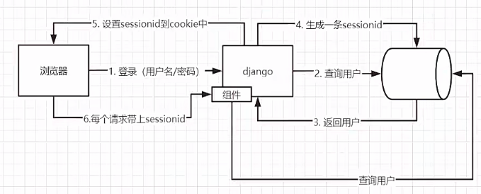
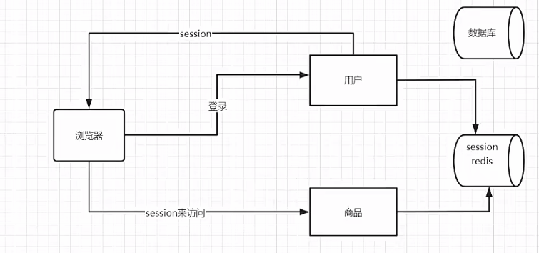
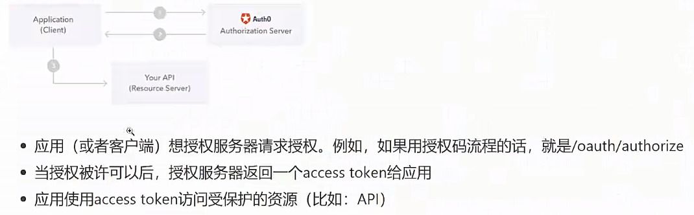

# 微服务设计
## week8 用户grpc服务
1. 同步用户表
```go
type BaseModel struct {
	ID        int32     `gorm:"primary_key"`
	CreatedAt time.Time `gorm:"column:add_time"`
	UpdatedAt time.Time `gorm:"column:update_time"`
	DeletedAt gorm.DeletedAt
	IsDelete  bool
}

type User struct {
	BaseModel
	Mobile   string     `gorm:"index:idx_mobile;unique;type:varchar(11);not null comment '11位电话号码'"`
	Password string     `gorm:"type:varchar(100);not null comment '密码，100位以内'"`
	NickName string     `gorm:"type:varchar(20) comment '昵称，20位以内'"`
	Birthday *time.Time `gorm:"type:datetime comment '出生日期'"`
	Gender   string     `gorm:"column:gender;default:male;type:varchar(6) comment 'female表示女，male表示男'"`
	Role     int        `gorm:"column:role;default:1;type:int comment '1表示普通用户，2表示管理员'"`
}
```
2. md5加密（信息摘要算法，密码不可反解）
    - 压缩性：任意长度的数据，计算出来的md5值都是一样长
    - 容易计算
    - 抗修改性：对于任意长度的数据，对数据进行任何修改，哪怕 modifications 是 ONE BIT， MD5 值也会改变
    - 抗碰撞性：对于任意长度的数据， MD5 函数的计算结果很难出现两个数据结果相同
    - 不可反解
   
     但是md5会被暴力破解（彩虹表）
    - md5盐值加密： 随机字符串+用户密码生成新的密码值 GitHub go-password-encoder
    - password存储： ”$算法$salt$encodedpwd"


3. 定义proto接口
```protobuf
syntax="proto3";
import "google/protobuf/empty.proto";
option go_package = "./;proto";

service User{
  rpc GetUserList(PageInfo) returns (UserListResponse); //用户列表
  rpc GetUserByMobile(MobileRequest) returns (UserInfoResponse);
  rpc GetUserById(IdRequest) returns (UserInfoResponse);
  rpc CreateUser(CreateUserInfo) returns (UserInfoResponse);
  rpc UpdateUser(UpdateUserInfo) returns (google.protobuf.Empty);
  rpc CheckPassword(PasswordCheckInfo) returns (CheckResponse);
}

message PageInfo{
  uint32 pn = 1;
  uint32 pSize = 2;
}

message MobileRequest{
  string mobile = 1;
}

message IdRequest{
  int32 id = 1;
}

message CreateUserInfo{
  string nickName = 1;
  string password = 2;
  string mobile = 3;
}

message UpdateUserInfo{
  int32 id = 1;
  string nickName = 2;
  string gender = 3;
  uint64 birthday = 4;
}

message PasswordCheckInfo{
  string password = 1;
  string encryptedPassword = 2;
}

message UserInfoResponse{
  int32 id = 1;
  string password = 2;
  string mobile = 3;
  string nickName = 4;
  uint64 birthday = 5;
  string gender = 6;
  int32 role = 7;
}

message UserListResponse{
  int32 total = 1;
  repeated UserInfoResponse data = 2;
}

message CheckResponse{
  bool success = 1;
}
```
生成protobuf go文件
```bash
protoc --go_out=. --go-grpc_out=.  user.proto
```
time.Unix(int64(req.Birthday), 0) 整型转时间戳

4. 启动grpc服务
使用flag进行参数解析
```go
    IP := flag.String("ip", "0.0.0.0", "ip地址")
	Port := flag.Int("port", 50052, "端口号")
	flag.Parse()
```
可以先build 在main.exe后面跟上参数，就可以手动指定ip：port

5. 测试grpc服务
建立grpc客户端 --> 编写测试函数 --> 运行测试函数


## week9 用户web服务
### 第一章 基础项目架构
#### zap 高性能日志库
```text
1.zap有两种日志记录器-Sugared Logger 和 Logger
    Sugared Logger: 方便，比其他日志库快4-10倍 需要用到反射，所以比Logger慢一点
    Logger: 更快，但是使用不这么方便，极致的性能
```

```text
2.zap输出到日志文件
# 自定义日志配置
func NewLogger() (*zap.Logger, error) {
	cfg := zap.NewProductionConfig()
	cfg.OutputPaths = []string{
		"stdout",
		"./myproject.log",
	}
	return cfg.Build()
}

logger, err := NewLogger()
	if err != nil {
		return
	}
	sugar := logger.Sugar()
	defer sugar.Sync()

3.直接拿带锁的全局日志
    zap.S() 返回的其实就是Sugared Logger
        1.S()可以获取一个全局的sugar，可以自己设置一个全局的logger
        2.日志是分级别的，debug，info，warn，error，panic，fatal
        3.S函数和L函数很有用，可以提供一个全局的安全访问logger的途径

```

```text
3.将grpc的错误码转换成http的错误码，返回给用户
func HandleGrpcErrorToHttp(err error, ctx *gin.Context) {
	// 将grpc的状态码转换成http的状态码
	if err != nil {
		if e, ok := status.FromError(err); ok {
			switch e.Code() {
			case codes.NotFound:
				ctx.JSON(http.StatusNotFound, gin.H{
					"msg": e.Message(),
				})
			case codes.Internal:
				ctx.JSON(http.StatusInternalServerError, gin.H{
					"msg": "内部错误",
				})
			case codes.InvalidArgument:
				ctx.JSON(http.StatusBadRequest, gin.H{
					"msg": "参数错误",
				})
			case codes.Unavailable:
				ctx.JSON(http.StatusInternalServerError, gin.H{
					"msg": "服务不可用",
				})
			default:
				ctx.JSON(http.StatusInternalServerError, gin.H{
					"msg": "其他错误",
				})
			}
			return
		}
	}

}
```

```text
4.gin集成viper
建立配置文件yaml --> 创建配置文件结构体 --> 创建全局变量保存配置 --> 创建配置文件初始化并读取函数 --> 在main中使用配置变量
```

### 第二章 用户接口开发
#### 表单验证初始化
```text
1.初始化验证器的翻译功能
func InitTrans(locale string) (err error) {
	//修改gin框架中的validator引擎属性, 实现定制
	if v, ok := binding.Validator.Engine().(*validator.Validate); ok {
		//注册一个获取json的tag的自定义方法
		v.RegisterTagNameFunc(func(fld reflect.StructField) string {
			name := strings.SplitN(fld.Tag.Get("json"), ",", 2)[0]
			if name == "-" {
				return ""
			}
			return name
		})

		zhT := zh.New() //中文翻译器
		enT := en.New() //英文翻译器
		//第一个参数是备用的语言环境，后面的参数是应该支持的语言环境
		uni := ut.New(enT, zhT, enT)
		global.Trans, ok = uni.GetTranslator(locale)
		if !ok {
			return fmt.Errorf("uni.GetTranslator(%s)", locale)
		}

		switch locale {
		case "en":
			en_translations.RegisterDefaultTranslations(v, global.Trans)
		case "zh":
			zh_translations.RegisterDefaultTranslations(v, global.Trans)
		default:
			en_translations.RegisterDefaultTranslations(v, global.Trans)
		}
		return
	}

	return
}
2.处理密码登录的验证流程
func PassWordLogin(ctx *gin.Context) {
    passWordLoginForm := forms.PassWordLoginForm{}
    if err := ctx.ShouldBind(&passWordLoginForm); err != nil {
        errors, ok := err.(validator.ValidationErrors)
        if !ok {
            ctx.JSON(http.StatusOK, gin.H{
                "msg": err.Error(),
            })
        }
        ctx.JSON(http.StatusBadRequest, gin.H{
            "error": removeTopStruct(errors.Translate(global.Trans)),
        })
    }
}
3.去除错误字段名中的结构体名称前缀
func removeTopStruct(fileds map[string]string) map[string]string {
    rsp := map[string]string{}
    for field, err := range fileds {
        rsp[field[strings.Index(field, ".")+1:]] = err
    }
    return rsp
}
4.反射
    应用场景，当不确定变量的类型是什么的时候，可以使用反射来获取
    比如调用接口，不知道获取到的是什么类型，只有在程序运行的时候才能判断是什么类型
    比如orm、json转换，通常在crud时很少用到反射，只有在写一些工具类时，或者写框架时，动态生成列表等需求时才会用到反射
    var n int = 1
    reflect.typeOf(n) type:*reflect.rtype
    reflect.valueOf(n) value:reflect.Value
    v.kind() kind:int
    
    //取类型
func getType(str interface{}) {
	t := reflect.TypeOf(str)
	fmt.Println(t)
	fmt.Printf("%T", t)
}
// 取值
func getValue(str interface{}) {
	v := reflect.ValueOf(str)
	k := v.Kind()
	switch k {
	case reflect.Int:
		ret := int(v.Int())
		fmt.Printf("%v,%T", ret, ret)
	}
}

//设置值
func setValue(str interface{}) {
	v := reflect.ValueOf(str)
	t := v.Elem().Kind()
	switch t {
	case reflect.Int:
		v.Elem().SetInt(100)
	}
}
//结构体的反射
```

#### 自定义mobile验证器
```text
func ValidateMobile(fl validator.FieldLevel) bool {
	mobile := fl.Field().String()
	// 使用正则表达式判断是否合法
	ok, _ := regexp.MatchString(`^1([38][0-9]|14[579]|5[^4]|16[6]|7[1-35-8]|9[189])\d{8}$`, mobile)
	if !ok {
		return false
	}
	return true
}
```

#### 登录逻辑
```text
func PassWordLogin(ctx *gin.Context) {
	// 表单验证
	passWordLoginForm := forms.PassWordLoginForm{}
	if err := ctx.ShouldBind(&passWordLoginForm); err != nil {
		//如何返回错误信息
		HandleValidatorError(ctx, err)
		return
	}
	ip := global.ServerConfig.UserSrvInfo.Host
	port := global.ServerConfig.UserSrvInfo.Port

	// 连接用户grpc服务
	conn, err := grpc.NewClient(fmt.Sprintf("%s:%d", ip, port), grpc.WithTransportCredentials(insecure.NewCredentials()))
	if err != nil {
		zap.S().Errorw("[GetUserList]连接用户服务失败",
			"msg", err.Error(),
		)
	}
	// 调用接口
	userClient := proto.NewUserClient(conn)

	if mobile, err := userClient.GetUserByMobile(ctx, &proto.MobileRequest{
		Mobile: passWordLoginForm.Mobile,
	}); err != nil {
		if s, ok := status.FromError(err); ok {
			switch s.Code() {
			case codes.NotFound:
				ctx.JSON(http.StatusBadRequest, gin.H{
					"mobile": "用户不存在",
				})
			default:
				ctx.JSON(http.StatusInternalServerError, gin.H{
					"mobile": "登陆失败",
				})
			}
			return
		}
	} else {
		// 只是查询到了用户，没有检查密码
		if checkResponse, err := userClient.CheckPassword(ctx, &proto.PasswordCheckInfo{
			Password:          passWordLoginForm.PassWord,
			EncryptedPassword: mobile.Password,
		}); err != nil {
			ctx.JSON(http.StatusInternalServerError, gin.H{
				"password": "登陆失败",
			})
		} else {
			if checkResponse.Success {
				ctx.JSON(http.StatusOK, gin.H{
					"msg": "登陆成功",
				})
			} else {
				ctx.JSON(http.StatusBadRequest, gin.H{
					"password": "登陆失败",
				})
			}
		}
	}
}

```
#### session机制
1.单体


2.微服务下的弊端
微服务中数据库是独立的，session要存在redis集群里面抗住大并发


#### json web token(jwt不需要存储)


#### jwt集成到gin中
```text
先加载配置文件生成配置类，接着定义jwt的claims，然后生成jwt，最后返回给前端
j := middlewares.NewJWT()
claims := models.CustomClaims{
  ID:          uint(rsp.Id),
  NickName:    rsp.NickName,
  AuthorityId: uint(rsp.Role),
  StandardClaims: jwt.StandardClaims{
      NotBefore: time.Now().Unix(),               //签名的生效时间
      ExpiresAt: time.Now().Unix() + 60*60*24*30, //30天过期
      Issuer:    "zzc",
  },
}
token, err := j.CreateToken(claims)
if err != nil {
  ctx.JSON(http.StatusInternalServerError, gin.H{
      "msg": "生成token失败",
  })
  return
}

ctx.JSON(http.StatusOK, gin.H{
  "id":        rsp.Id,
  "nick_name": rsp.NickName,
  "token":     token,
  "expire_at": (time.Now().Unix() + 60*60*24*30) * 1000,
})
```